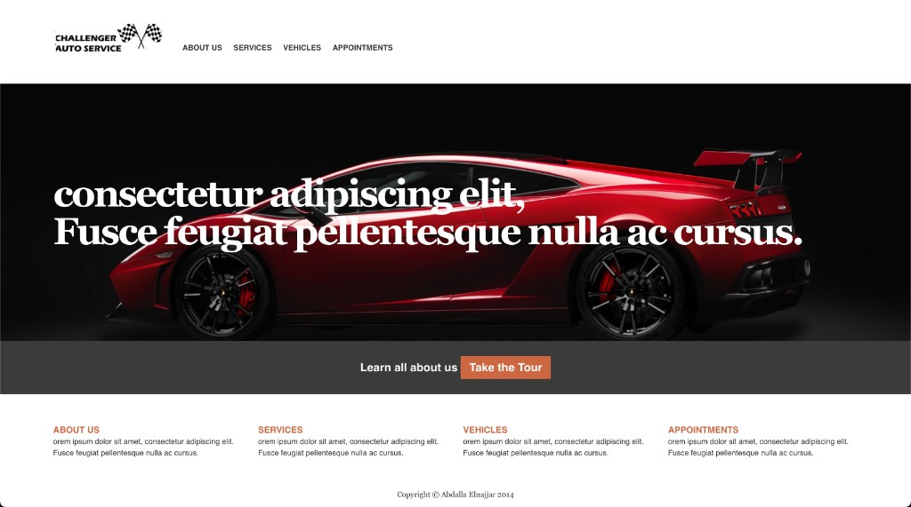
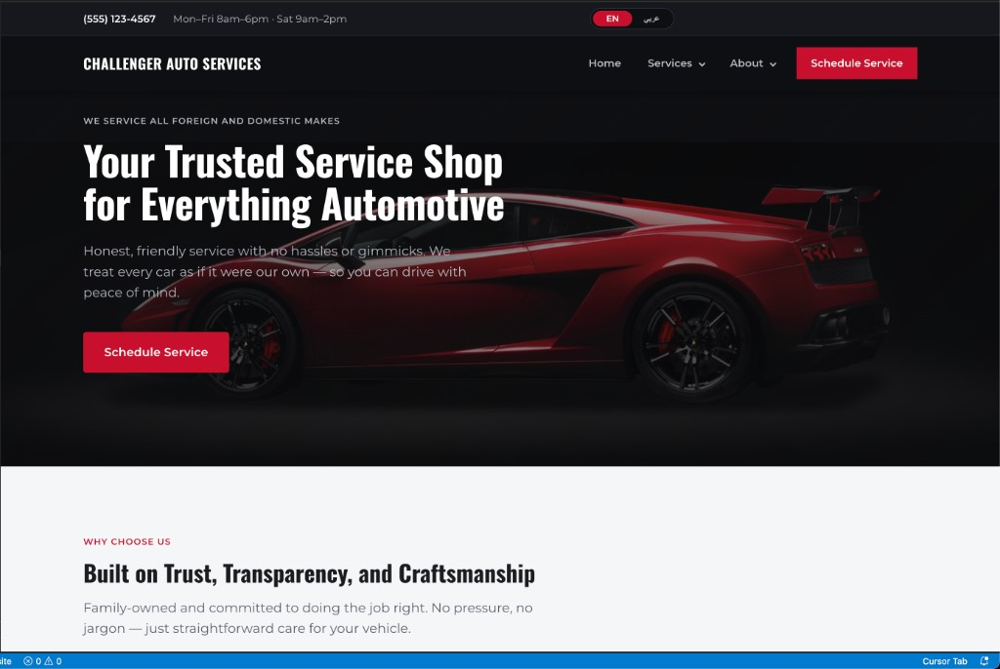

# Challenger Auto Services Website

Static marketing site for an auto repair shop — responsive layout, SEO metadata, animated hero, and a Motion-powered mega menu.

**Live site:** [https://a-elnajjar.github.io/ChallengerAutoServices_website](https://a-elnajjar.github.io/ChallengerAutoServices_website)

## Before & after update

### Before update



### After update



## URLs

| | Link |
|---|---|
| **Live site** | [https://a-elnajjar.github.io/ChallengerAutoServices_website](https://a-elnajjar.github.io/ChallengerAutoServices_website) |
| **Arabic** | [https://a-elnajjar.github.io/ChallengerAutoServices_website/?lang=ar](https://a-elnajjar.github.io/ChallengerAutoServices_website/?lang=ar) |
| **Repository** | [https://github.com/a-elnajjar/ChallengerAutoServices_website](https://github.com/a-elnajjar/ChallengerAutoServices_website) |

## Tech stack

- **HTML5** — semantic landmarks, structured data (JSON-LD), Open Graph / Twitter meta tags
- **CSS3 / Sass** — design tokens as CSS custom properties, mobile-first responsive layout
- **Vanilla JavaScript (ES modules)** — mega menu and banner animations via [Motion](https://motion.dev/) (CDN)
- **Google Fonts** — Oswald (headings), Montserrat (body)

No build step or framework is required to run the site. Sass is only needed when editing styles.

## Project structure

```
├── index.html              # Main page
├── styles.css              # Compiled CSS (committed for GitHub Pages)
├── styles.css.map          # Source map for browser dev tools
├── design-tokens.json      # Color, typography, and spacing reference
├── sass/
│   ├── styles.scss         # Source styles — edit this file
│   └── _grid.scss          # Grid / layout helpers
├── js/
│   ├── i18n.js             # English / Arabic translations and language switcher
│   ├── mega-menu.js        # Desktop/mobile navigation mega menu
│   ├── banner-motion.js    # Hero entrance and scroll animations
│   └── html5shiv.js        # Legacy IE HTML5 shim (unused on modern browsers)
└── img/                    # Logo, hero background, and other assets
```

## Local development

1. Clone the repo and open `index.html` in a browser, or serve the folder with any static server:

   ```bash
   python3 -m http.server 8080
   ```

2. When editing styles, recompile Sass:

   ```bash
   npx -p sass sass sass/styles.scss styles.css
   ```

   This updates both `styles.css` and `styles.css.map`.

## Features

- **Sticky two-tier header** — utility bar (phone, hours) + primary navigation
- **Mega menu** — Services and About dropdowns with keyboard support and mobile collapse
- **Hero section** — parallax background and Motion-driven entrance animations (desktop)
- **Content sections** — Why Choose Us, service cards, contact CTA, footer
- **SEO** — meta description, canonical URL, `AutoRepair` schema.org markup, semantic headings and links
- **Bilingual (EN / العربية)** — language switcher in the header, RTL layout for Arabic, preference saved in `localStorage` (share Arabic via `?lang=ar`)

## Design system

Visual styling follows `design-tokens.json` (dark base `#0E0F12`, accent red `#C8102E`, alternating dark/light sections). Tokens are implemented as CSS variables in `sass/styles.scss`.

## Deployment

The site is deployed via **GitHub Pages** from the `master` branch at:

[https://a-elnajjar.github.io/ChallengerAutoServices_website](https://a-elnajjar.github.io/ChallengerAutoServices_website)

Push changes to the default branch; no separate build pipeline is required as long as `styles.css` is kept in sync with Sass.

## Customization

Replace placeholder business details in `index.html` (phone, address, hours) and in the JSON-LD block in the `<head>`. Update the canonical and Open Graph URLs if you move to a custom domain.

To edit translations, update the `en` and `ar` objects in `js/i18n.js`.

## License

All rights reserved unless otherwise noted.
